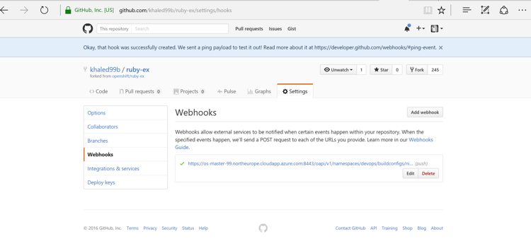

# OpenShift on Azure

> By Khaled Elbedri, November, 2016


## Table of Contents

   * [OpenShift on Azure](#openshift-on-azure)
      * [Overview and Pre-Requisites](#overview-and-pre-requisites)
         * [Pre-requisites](#pre-requisites)
         * [Topics Covered](#topics-covered)
      * [Introduction to OpenShift](#introduction-to-openshift)
      * [Lab1: Deploy Openshift on Azure](#lab1-deploy-openshift-on-azure)
      * [Lab2: Create and manage projects](#lab2-create-and-manage-projects)
      * [Lab3: Create and manage Applications](#lab3-create-and-manage-applications)
      * [Lab4: Configuring automated builds](#lab4-configuring-automated-builds)
      * [Lab5: Continuous deployment](#lab5-continuous-deployment)
      * [End the lab](#end-the-lab)
      * [Additional Resources and References](#additional-resources-and-references)
         * [Useful Links](#useful-links)
         * [Microsoft and Red Hat partnership](#microsoft-and-red-hat-partnership)
      * [License](#license)


## Overview and Pre-Requisites


This document describes the steps necessary to deploy and manage OpenShift.orig (Red Hat OpenShift container platform) environment on Azure. OpenShift.orig is the upstream project and is a test bed incubator for Red Hat OpenShift container platform. The labs will be based on OpenShift version 3.3.


### Pre-requisites

You don’t need a Red Hat subscription to perform the lab instructions. But you will need a valid Azure account. 

* Create your [free azure account](https://azure.microsoft.com/en-us/free/), today.
* You need to have an account on [GitHub](https://github.com/).
* If you are using Windows 10, you can install Bash shell on Ubuntu on Windows ([http://www.windowscentral.com/how-install-bash-shell-command-line-windows-10](http://www.windowscentral.com/how-install-bash-shell-command-line-windows-10)). To install Azure CLI, download and install the latest Node.js and npm  for Ubuntu ([https://nodejs.org/en/download/package-manager/#debian-and-ubuntu-based-linux-distributions](https://nodejs.org/en/download/package-manager/#debian-and-ubuntu-based-linux-distributions)). Then, follow the instructions (*Option-1*): [https://azure.microsoft.com/en-us/documentation/articles/xplat-cli-install/](https://azure.microsoft.com/en-us/documentation/articles/xplat-cli-install/)
* If you are using MAC or another windows version, install Azure CLI, following *Option-2*: [https://azure.microsoft.com/en-us/documentation/articles/xplat-cli-install/](https://azure.microsoft.com/en-us/documentation/articles/xplat-cli-install/)
* *[Optional]* [Download](https://code.visualstudio.com/) and install Visual Studio Code


### Topics Covered

* Introduction to OpenShift3
* Deployment of OpenShit.orig on Azure
* Creating and managing OpenShift projects on azure
* Creating and managing OpenShift applications on Azure
* Automating builds with Linux Containers on Azure.


## Introduction to OpenShift

OpenShift containers platform is Red Hat's Platform-as-a-Service (PaaS) that allows developers to quickly develop, host, and scale applications in a cloud environment.

Microsoft and Red Hat have signed a partnership that includes support to run Red Hat OpenShift on Microsoft Azure and potentially Azure Stack. 

OpenShift offers multiple access mode including: developer CLI, admin CLI, web console and IDE plugins. Click2cloud is a plugin that allows Visual studio to deploy code to OpenShift, directly.  


*[Figure 1: OpenShift capabilities]*


## Lab1: Deploy Openshift on Azure 

OpenShift, leverages multiple Azure services such as VM *scale sets*, VM *extensions*, and *Key vaults* to provide an Enterprise grade offering for customers who would like to containerize and manage their applications, without investing long time and hard effort configuring and integrating various tools.

OpenShift offers another alternative to multiple CaaS (container as a service) solutions available on Azure, such as *Azure Container Service* and *Pivotel* from *CloudFoundry*. 


*[Figure 2: OpenShift on Azure]*


1. OpenShift is available as an Azure Resource Manager quick deploy template at [https://github.com/khaled99b/azure-quickstart-templates/tree/master/openshift-origin-rhel](https://github.com/khaled99b/azure-quickstart-templates/tree/master/openshift-origin-rhel). Click on the *Visualize* button and navigate the Azure resources that will be deployed by the template.


*[Figure 3: OpenShift ARM template resources]*


2. Start a *Bash* session and login to your Azure account by following the login instructions

```
# azure login
```

3. Make sure the Azure CLI is using Resource Manager mode

```
# azure config mode arm
    info:    Executing command config mode
    info:    New mode is arm
    info:    config mode command OK
```

4. List available account subscriptions and note the default on

```
# azure account list
```

5. Create a new Azure storage account *openshiftRG* in your preferred region

```
# azure group create openshiftRG northeurope
    info:    Executing command group create
    + Getting resource group openshiftRG
    + Creating resource group openshiftRG
    info:    Created resource group openshiftRG
    data:    Id:                  /subscriptions/f2a5dfdb-e853-42d9-b23c-752c817c0290/resourceGroups/ openshiftRG
    data:    Name:                openshiftRG
    data:    Location:            northeurope
    data:    Provisioning State:  Succeeded
    data:    Tags: null
    data:
    info:    group create command OK
```

6. Create an *ssh keypair* with a blank passphrase

```
# ssh-keygen
    Generating public/private rsa key pair.
    Enter file in which to save the key (/home/azureuser/.ssh/id_rsa):
    Enter passphrase (empty for no passphrase):
    Enter same passphrase again:
    Your identification has been saved in /home/azureuser/.ssh/id_rsa.
    Your public key has been saved in /home/azureuser/.ssh/id_rsa.pub.
    The key fingerprint is:
    ... output omitted ...
```

7. Create an Azure *Key vault* for private *ssh* key storage

```
# azure keyvault create -u my-key-vault -g openshiftRG -l northeurope
```

8. Create a secret to protect the private key

```
# azure keyvault secret set -u my-key-vault -s my-os-secret --file .ssh/id_rsa
```

9. Enable the Key Vault for Template Deployments:

```
# azure keyvault set-policy -u my-key-vault --enabled-for-template-deployment true
```

10. To deploy from the template, you have multiple options. You could use the graphical or command line interface:

**Option1:** Click on the link *"Deploy to Azure"* and fill the form with the required information as per the bellow table. Note, that, if you have to redeploy because of any error, you would have to delete and recreate the resource group.

| Field                                         | Value                             |
| --------------------------------------------- | --------------------------------- |
| Subscription                                  | Select the subscription to use    |
| Resource group                                | openshiftRG                       |
| Location                                      | North Europe                      |
| _artifacts Location                           | Keep default option               |
| Master Vm Size                                | Standard_A4                       |
| Node Vm Size                                  | Standard_A4                       |
| Os Image                                      | centos                            |
| Openshift Master Hostname                     | master                            |
| Openshift Master Public Ip Dns Label Prefix   | os-master-XXX (globally unique)   |
| Node Lb Public Ip Dns Label Prefix            | os-node-XXX (globally unique)     |
| Node Prefix                                   | node                              |
| Node Instance Count                           | 2                                 |
| Admin Username                                | azureuser                         |
| Admin Password                                | Choose your password              |
| Ssh Public Key                                | Copy the contents of *id_rsa.pub* |
| Key Vault Resource Group                      | openshiftRG                       |
| Key Vault Name                                | my-key-vault                      |
| Key Vault Secret                              | my-os-secret                      |
| Default Sub Domain Type                       | xipio                             |
| Default Sub Domain                            | xipio                             |


Agree on the terms and conditions and purchase.  The template will deploy the VMs infrastructure and the custom script extensions, will call *Ansible* for the deployment of OpenShift and the configuration of the cluster. The process will take around 30 minutes. From the Azure portal, click on the openshiftRG resource group and keep an eye on the progress of the deployment of the different resources.

**Option2:** Alternatively, you can download a local copy of the *github* repository and use your preferred editor (visual studio code, vim, emacs…) to modify the `azuredeploy.paramters.json` file. You can use the "readme" file as a reference to the parameters. Save the file under a different name, example: `azuredeploy.paramters.local.json`. Then, use the Azure CLI, to deploy from the local template.

```
azure group deployment create openshiftRG TestDeploy1 --template-file azuredeploy.json --parameters-file azuredeploy.parameters.local.json
```

Once successfully finished. Navigate the newly created resource group in the Azure portal. Select Deployments -> OpenShiftDeployment and note the *OPENSHIFTMASTERPUBLICIPFQDN*

11. Ssh into the master node and escalate the user’s privileges to admin level

```
ssh -i .ssh/id_rsa azureuser@OPENSHIFTMASTERPUBLICIPFQDN

[master-node]# sudo oadm policy add-cluster-role-to-user cluster-admin azureuser
```

The following diagrams explain the physical and logical architecture of the deployed cluster.


*[Figure 4: Deployment diagram]*


*[Figure 5: OpenShift logical architecture]*


## Lab2: Create and manage projects 

There are many ways to launch images within an OpenShift project. For the sake of simplicity, we will focus on the quickest and easiest method.

To create an *application*, you must first create a new *project*, then select an *InstantApp* template. From there, OpenShift begins the build process and creates a new deployment. 

1. Login to you *github* account, or create one if you didn’t.

2. Browse to `openshift/ruby-ex` repository and clone it into your github account


*[Figure 6: clone ruby-ex sample application]*


3. From your browser, visit the OpenShift web console at `https://FQDN-master-node:8443`. The web site, uses a self-signed certificate, so if prompted, continue and ignore the browser warning. 

4. Log in using your username and password. 


*[Figure 7: OepnShift login console]*


5. To create a new project, click **New Project**.

6. Type a unique name, display name, and description for the new project. 

7. Click **Create**. The web console’s welcome screen should start loading.


*[Figure 8: OepnShift new project]*


## Lab3: Create and manage Applications

The *Select Image* or *Template* page gives you the option to create from a publicly accessible *Git* repository, or from a *template*:

1. If creating a new project did not automatically redirect you to the *Select Image* or *Template* page, you might need to click **Add to Project**.

2. Click **Browse**, then select *ruby* from the drop-down list.  


*[Figure 9: Create ruby builder]*


3. Click the **ruby:latest** builder image.

4. Type a *name* for your application, and specify the git repository url you previously cloned: `https://github.com/<your_github_username>/ruby-ex.git`.


*[Figure 10: Build and run ruby]*


5. Optionally, click **Show advanced routing, build, and deployment options**. Explore the build configuration and other options and note that this example application automatically creates a route, *webhook* trigger, and builds change triggers.

6. Click **Create*. Creating your application might take some time. note the *payload url*, we will use it later to set a webhook in the github repository.


*[Figure 11: Create a ruby application]*


7. You can follow along on the **Overview** page of the web console to see the new resources being created, and watch the progress of the build and deployment. While the Ruby *pod* is being created, its status is shown as pending. The Ruby *pod* then starts up and displays its newly-assigned IP address. When the Ruby pod is running, the build is complete.


*[Figure 12: Ruby application pod]*


8. From the overview page, click the web address for the application in the up right corner. Verify that the web application is up and available.


*[Figure 13: ruby sample application]*


9. Return to the *OpenShift* admin console. Browse to the project’s overview page, and test scaling out and scaling in your application by increasing or decreasing the number of *pods*. Scale out the app into 3 pods.


*[Figure 14: Scaling out the application]*


10. Browse to **Applications -> Pods**, and make sure 3 pods serving the same application are now up and running.


*[Figure 15: scaled out pods]*


## Lab4: Configuring automated builds

Since we forked the source code of the application from the [OpenShift GitHub repository](https://github.com/openshift/ruby-ex), we can use a *webhook* to automatically trigger a rebuild of the application whenever code changes are pushed to the forked repository.

To set up a webhook for your application: 

1. From the Web Console, navigate to the project containing your application.

2. Click the **Browse** tab, then click **Builds**.

3. Click your build name, then click the **Configuration** tab.

4. Click next to **GitHub webhook URL** to copy your *webhook* payload URL.


*[Figure 16: openshift github webhook url]*


5. Navigate to your forked repository on GitHub, then click **Settings**.

6. Click **Webhooks & Services**.

7. Click **Add webhook**. 


*[Figure 17: github webhook configuration]*


8. Paste your *webhook* URL into the **Payload URL** field.

9. Disable SSL verification and click **Add webhook** to save.

GitHub will now attempt to send a ping payload to your *OpenShift* server to ensure that communication is successful. If you see a green check mark appear next to your *webhook* URL, then it is correctly configured. Hover your mouse over the check mark to see the status of the last delivery. 




*[Figure 18: webhook ping]*


Next time you push a code change to your forked repository, your application will automatically rebuild. 


## Lab5: Continuous deployment

In this section, we demonstrate one of the most powerful features of *OpenShift*. We will see how we can trigger a continuous deployment pipeline, just by committing code change to Github.

Once there is a code change, the Github *webhook* will trigger the build of a new container image that combines a blueprint image from the registry with the updated code and generate a new image. This feature is called _**S2I**_, or source to image. Once the build finishes, *OpenShift* will automatically deploy the new application based on the new image. This capability enables multiple deployment strategies such as A/B testing, Rolling upgrades...


*[Figure 19: Continuous deployment pipeline]*


1. Install *Git* into your local machine

```
[azure-vm]# sudo apt-get install git
```

2. Create a "dev" folder and change into. 

```
[azure-vm]# mkdir dev && cd dev
```

3. Clone the forked repository to your local system

```
[azure-vm dev]# git clone https://github.com/<YourGithubUsername>/ruby-ex.git
```

4. Make sure your local *git* repository is referencing to your *ruby-ex git*, on *github*:

```
[azure-vm dev]# cd ruby-ex

[azure-vm ruby-ex]# git remote -v
```

5. On your local machine, use your preferred text editor to change the sample application’s source for the file `config.ru`

Make a code change that will be visible from within your application. For example: on line 229, change the title to "Welcome to your Ruby application on OpenShift powered by Azure!", then save your changes.

6. Verify the working tree status

```
[azure-vm ruby-ex]# git status
```

7. Add `config.ru` content to the index, Commit the change in *git*, and push the change to your fork. You will need to authenticate with your *github* credentials

```
[azure-vm ruby-ex]# git add config.ru
[azure-vm ruby-ex]# git commit -m "simple message"  
[azure-vm ruby-ex]# git status
[azure-vm ruby-ex]# git push
```

8. If your *webhook* is correctly configured, your application will immediately rebuild itself based on your changes. Monitor the build from the graphical console. Once the rebuild is successful, view your updated application using the route that was created earlier. Now going forward, all you need to do is push code updates and OpenShift handles the rest.


*[Figure 20: Automated build]*


*[Figure 21: Automated deployment*


*[Figure 22: Automated deployment - progressive]*


*[Figure 23: Updated application]*


9. You may find it useful to manually rebuild an image if your webhook is not working, or if a build fails and you do not want to change the code before restarting the build. To manually rebuild the image based on your latest committed change to your forked repository:
  * Click the **Browse** tab, then click **Builds**. 
  * Find your build, then click **Start Build**.

## End the lab

To end the lab, simply delete the resource group *openshiftRG* from the Azure portal or from the Azure CLI. And delete the created *webhook* from your *git* repository.

```
# azure group delete openshiftRG
```


## Additional Resources and References


### Useful Links

* [https://access.redhat.com/documentation/en/openshift-container-platform/](https://access.redhat.com/documentation/en/openshift-container-platform/)
* [https://visualstudiogallery.msdn.microsoft.com/9a5b8b19-dadf-4b46-8712-527303d32231](https://visualstudiogallery.msdn.microsoft.com/9a5b8b19-dadf-4b46-8712-527303d32231)
* [http://open.microsoft.com/](http://open.microsoft.com/)
* [https://github.com/microsoft/](https://github.com/microsoft/)

### Microsoft and Red Hat partnership

* [http://openness.microsoft.com/2016/04/15/microsoft-red-hat-partnership-accelerating-partner-opportunities/](http://openness.microsoft.com/2016/04/15/microsoft-red-hat-partnership-accelerating-partner-opportunities/)
* [https://www.redhat.com/en/microsoft](https://www.redhat.com/en/microsoft)

## License

Copyright (c) Microsoft Corporation. All rights reserved.

Licensed under the [MIT](LICENSE) License.